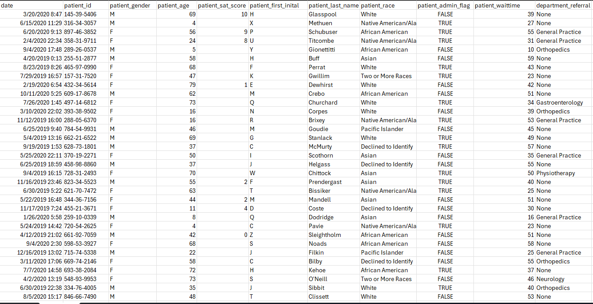

# Data Preparation Document for Patient Dataset

## Data Examination

The dataset provided contains patient visit information with the following fields:

| Field Name | Description | Format/Values |
|------------|-------------|---------------|
| `date` | Date and time of patient visit | MM/DD/YYYY HH:MM |
| `patient_id` | Unique patient identifier | XXX.XX-XXXX |
| `patient_gender` | Patient's gender | M/F |
| `patient_age` | Patient's age in years | Integer |
| `patient_sat_score` | Patient satisfaction score | Alphanumeric |
| `patient_first_initial` | First initial of first name | Single letter |
| `patient_last_name` | Patient's last name | Text |
| `patient_race` | Racial/ethnic identification | Text categories |
| `patient_admin_flag` | Administrative status flag | TRUE/FALSE |
| `patient_waittime` | Wait time in minutes | Integer |
| `department_referral` | Referral department | Text or "None" |

## Data Transformation Plan

### 1. Data Cleaning and Standardization

- **Date Format Standardization**  
  Convert to proper datetime format and potentially split into separate date/time columns

- **Patient ID Validation**  
  Verify all IDs follow XXX.XX-XXXX format and are unique

- **Gender Standardization**  
  Confirm only M/F values exist, convert to full words (Male/Female) if needed

- **Age Validation**  
  Check for reasonable values (0-120), flag outliers

- **Race Standardization**  
  Clean categories:  
  - "Native American/Ala" → "Native American"  
  - "Declined to Identify" → "Unknown"  
  - Standardize capitalization

- **Boolean Flag Conversion**  
  Convert TRUE/FALSE to 1/0 for better analysis

### 2. Data Enhancement

- **Visit ID Creation**  
  Add unique `visit_id` for each record

